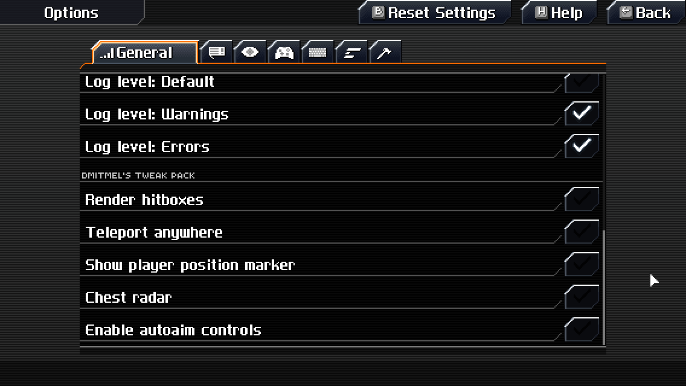
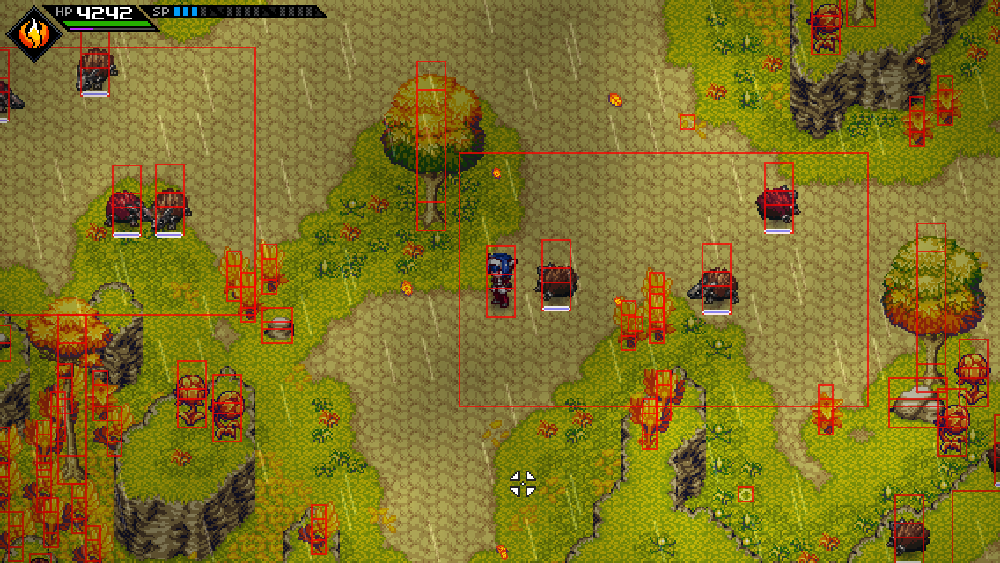
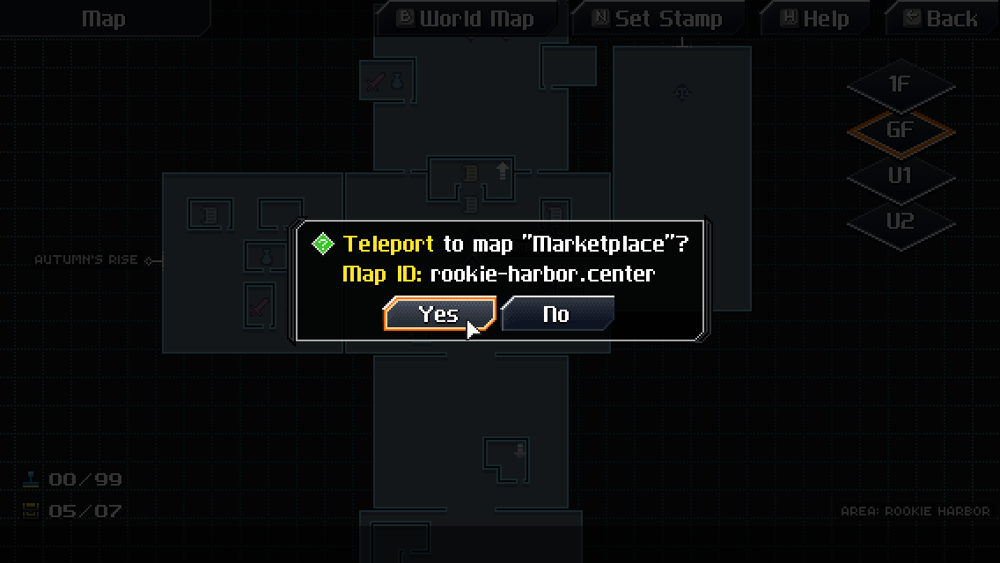
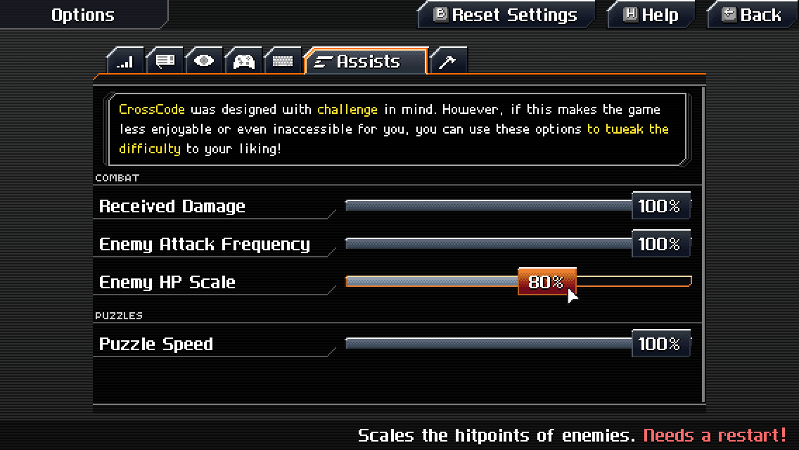
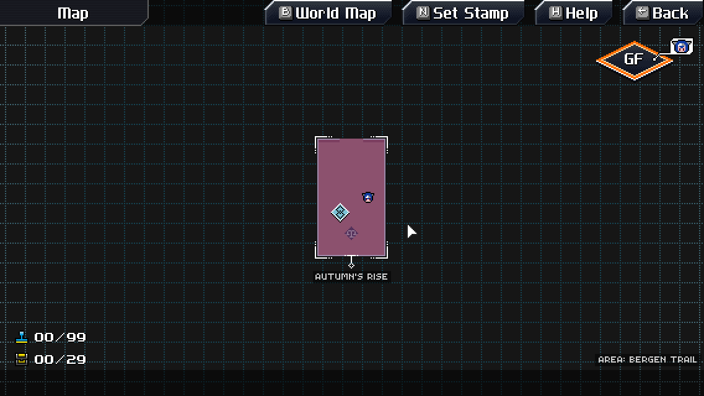
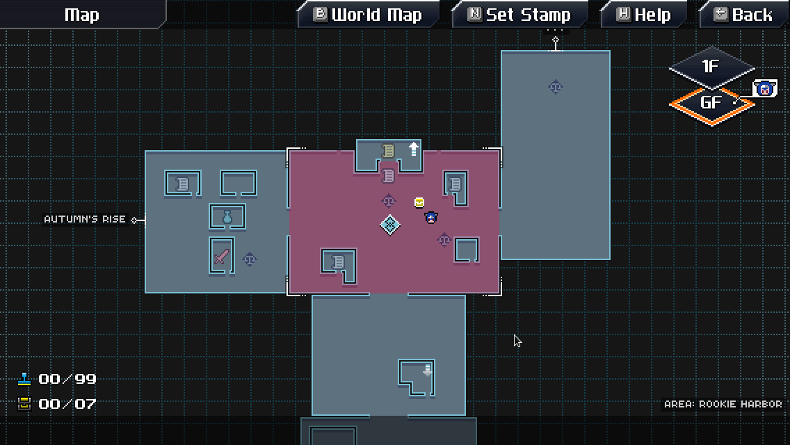

# dmitmel's tweak pack

Micro-mods by [dmitmel](https://github.com/dmitmel) in a single 999-in-1 package, ranging from QoL
tweaks to cheats. Also includes tools for debugging and mod development!

## Included mods

The mods in this list are divided into various categories:

- **QoL** - quality-of-life, various enhancements that don't affect the gameplay significantly.
  **Recommended by me for the first playthrough!** (also see my other mod called
  [World map overhaul](#world-map-overhaul)).
- **debug** - tools for debugging or somehow else related to mod development.
- **cheat** - self-descriptive and come with all implications of cheating (i.e. condemnation from
  random people on the Internet), but it's not like I'm gonna prevent you from using these. :P
- **assist** - additional settings for the
  [Assist Mode](https://www.reddit.com/r/Games/comments/9qhlc5/crosscode_updated_to_101_introduces_assist_mode/).

Most mods are disabled by default (where it is technically possible).

### Sidenote: Where to find settings of the included mods?

It's simple. Most of them can be found by scrolling down in the **"General"** tab of the regular
game settings menu:

However, other settings may go to other tabs where it makes more sense. For instance, all shortcuts
are added to the **"Controls"** tab, and all assist options are, obviously, added to the
**"Assists"** tab.

### Bindable mouse buttons [QoL]

[_Previous location_](https://github.com/dmitmel/dotfiles/commit/bddaea14dd98032b28abb1ab238dc7684466332a)
\
_Always enabled_

Allows binding the 4th and 5th mouse buttons (sometimes called "side buttons") to any action in the
Controls settings. **Be aware that those buttons don't have an icon for now!**

### Right mouse rebind [QoL]

[_Previous location_](https://github.com/ilyabodo/crosscode-tweak-pack)

Allows the right mouse button functionality to be changed. Currently the right mouse button can be set to: melee, dash only, or guard only.

### Render hitboxes [debug]

[_Previous location_](https://github.com/dmitmel/crosscode-render-hitboxes)

Renders hitboxes as red wireframes.

### Teleport anywhere! [cheat]

[_Previous location_](https://github.com/dmitmel/crosscode-teleport-anywhere)

Teleport to any map/room in an area or a dungeon simply by clicking it in the map menu. **Doesn't
work with gamepads** because the developer doesn't have one for testing.

### Scale enemy HP [assist]

[_Previous location_](https://github.com/dmitmel/crosscode-scale-enemy-hp)

Adds an assist option which scales the hitpoints of enemies. **Note that the game needs to be
restarted after changing it!** Based on <https://github.com/falcorr/CCscaleHP>
(<https://gbatemp.net/threads/crosscode-mods.578327/>).

### Player position marker [QoL]

[_Previous location_](https://github.com/dmitmel/dotfiles/commit/20d80eeb75244d13ca9847e45e92011cf4280ba9)

Shows a marker for the player's position on the current map. **Isn't accurate due to the limitations
of the game**, but is useful as a reference for placing stamps.

### Chest radar [cheat]

Shows markers for all chests in the current map (they are not saved as stamps).

### Map menu shortcut [QoL]

[_Previous location_](https://github.com/dmitmel/dotfiles/commit/94ffec0a8dac79aa7e6d25a3b73d924e5b7f42d1)
\
_Always enabled_

Adds a shortcut for quickly opening and closing the map menu, by default assigned to the key `M`.
Note that you need to have the [input-api](https://github.com/CCDirectLink/input-api) mod installed
if you want to rebind this shortcut.

### Autoaim controls [cheat]

[_Previous location_](https://github.com/dmitmel/dotfiles/commit/6ce58bedee8a8157db1def6b09b8e910626118ca)

**An experimental mod**, allows playing the game (to some extent) without moving the mouse. Use the
`Q` and `E` keys to focus any enemy, the cursor will follow the focused enemy automatically, and you
can move the cursor with the mouse to unfocus.

### Skip title screen intro [debug]

Does exactly what it says on the tin - skips the intro sequence with logos which plays before the
title screen.

## Other recommended QoL mods

These mods are not included in this pack, but will be interesting nonetheless if you are looking for
QoL stuff. Again, **recommended by me for the first playthrough!**

### [World map overhaul](https://github.com/dmitmel/cc-world-map-overhaul#readme)

[_Homepage_](https://github.com/dmitmel/cc-world-map-overhaul#readme)

Adds a better world map for CrossCode.

## Contributing

PRs are really appreciated! As you can see, almost every mod comes with a little catch or warning,
I'd really love those to be fixed!

## License

Written starting in 2020 by [dmitmel](https://github.com/dmitmel). \
To the extent possible under law, the author(s) have dedicated all copyright and related and neighboring
rights to this software to the public domain worldwide. This software is distributed without any warranty.
\
You should have received a copy of the CC0 Public Domain Dedication along with this software. If
not, see <http://creativecommons.org/publicdomain/zero/1.0/>.
